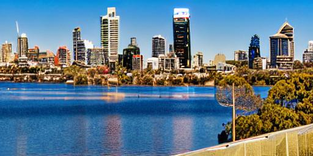

**These steps are now obsolete; use [AUTOMATIC1111/stable-diffusion-webui] or similar.**

[AUTOMATIC1111/stable-diffusion-webui]: https://github.com/AUTOMATIC1111/stable-diffusion-webui


# stable-diffusion-steps

Steps to get Stable Diffusion working on a Debian laptop
with NVIDIA GeForce RTX 3050 (Total Dedicated Memory 3910&nbsp;MB).


## 1. Install Conda

Based on the guide for Debian at <<https://docs.conda.io/projects/conda/en/latest/user-guide/install/rpm-debian.html>>.

```bash
$ curl https://repo.anaconda.com/pkgs/misc/gpgkeys/anaconda.asc | gpg --dearmor > conda.gpg
$ sudo install -o root -g root -m 644 conda.gpg /usr/share/keyrings/conda-archive-keyring.gpg

$ gpg --keyring /usr/share/keyrings/conda-archive-keyring.gpg --no-default-keyring --fingerprint 34161F5BF5EB1D4BFBBB8F0A8AEB4F8B29D82806
$ echo "deb [arch=amd64 signed-by=/usr/share/keyrings/conda-archive-keyring.gpg] https://repo.anaconda.com/pkgs/misc/debrepo/conda stable main" | sudo tee -a /etc/apt/sources.list.d/conda.list

$ sudo apt update
$ sudo apt install conda
```


## 2. Get [basujindal's fork] of Stable Diffusion

[basujindal's fork]: https://github.com/basujindal/stable-diffusion

```bash
$ git clone https://github.com/basujindal/stable-diffusion basujindal-stable-diffusion
$ cd basujindal-stable-diffusion/
```


## 3. Enable the Conda environment

```bash
$ source /opt/conda/etc/profile.d/conda.sh
$ conda env create -f environment.yaml
$ conda activate ldm
```

The terminal should now be prefixed with `(ldm)`,
and `which python3` should point to the one in the Conda environment.


## 4. Get the weights

1. Sign up to <<https://huggingface.co/>>.

2. Download `sd-v1-4.ckpt` from <<https://huggingface.co/CompVis/stable-diffusion-v-1-4-original>>.

3. Link the weights:

   ```bash
   $ mkdir -p models/ldm/stable-diffusion-v1
   $ ln -sf /path/to/sd-v1-4.ckpt models/ldm/stable-diffusion-v1/model.ckpt
   ```


## 5. Generate images

My machine does not have enough VRAM to do full-sized images (512×512),
but is able to do three-quarter sized (512×384).
The below examples are half-sized (512×256).

### `img2img`

```bash
$ python3 optimizedSD/optimized_img2img.py --prompt "Perth skyline, oil painting" --init-img perth-skyline-sketch.png --strength 0.5 --n_samples 5 --H 256 --W 512 --seed 0 --format jpg
```

- Input:

  

- Output:

  | Seed | Output |
  | - | - |
  | 0 |  |
  | 1 |  |
  | 2 |  |
  | 3 |  |
  | 4 |  |

### `txt2img`

```bash
$ python3 optimizedSD/optimized_txt2img.py --prompt "Perth City and the Swan River as viewed from King's Park" --H 256 --W 512 --seed 0 --format jpg
```

| Seed | Output |
| - | - |
| 0 |  |
| 1 |  |
| 2 |  |
| 3 |  |
| 4 |  |
